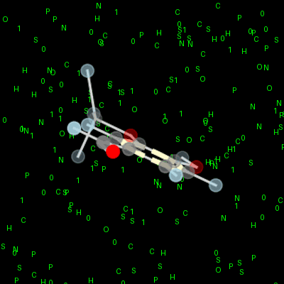

<h1 align="center">A little about me</h1>

I’m Daniel — a chemistry and data science student at UC Berkeley with a love for computational chemistry, nuclear science, human-centered data, and visual storytelling. I’m passionate about using technical tools to make a meaningful difference, especially at the intersections of science and society. I'm always learning and looking for new ways to merge scientific insight with creative problem-solving and contribute to projects with real-world impact.

 

<!-- Rotating Vanillin GIF -->

  

---

## 🔧 Skills

### 🐹 Programming Languages

### 📚 Libraries & Tools

### 💻 Software & Platforms

---

## 🌱 Other things about me!
⌬ Favorite molecules by category:

Organic: Vanillin — it’s what gives vanilla products their smell and taste!🍦

Inorganic: Plutonium(III) chloride — Its tricapped trigonal prismatic geometry and peculiar behavior in high-temperature salt environments make it a prime subject for molecular dynamics simulations ᵕ̈ ☢

Organometallic: Uranocene — it glows my favorite color (green) and contains my favorite element: uranium! ⚛

 

🖥️ **Favorite programming language:** Python 🐍  
🧠 **Favorite technology:** PyTorch 🔥  

 

**Interests (non-academic):**  
- Helping others in meaningful ways •ᴗ•
- Painting 🎨, Ceramics 🏺, and Drawing ✏️
- Crafting picturesque visualizations and explanations that make complex ideas understandable for others

<!-- PizzaTime GitHub contribution graph -->

  <picture>
    <source media="(prefers-color-scheme: dark)" srcset="https://raw.githubusercontent.com/DChristensen12/DChristensen12/output/pacman-contribution-graph-dark.svg">
    <source media="(prefers-color-scheme: light)" srcset="https://raw.githubusercontent.com/DChristensen12/DChristensen12/output/pacman-contribution-graph.svg">
    
  </picture>

---

## 📫 Connect with Me

