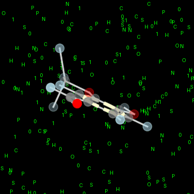

<table>
<tr>
<td width="58%" valign="middle">

I'm Daniel, a researcher at UC Berkeley and Lawrence Berkeley National Laboratory working where chemistry meets data science. 
I build machine learning and high-performance computing tools to take on hard problems in climate science and sustainable energy systems.

My curiosity also runs into nuclear science, green chemistry, and astrochemistry!

What I care about most is using computation to turn difficult scientific questions into working solutions, and carrying that work into the places where science actually meets the world.

</td>
<td width="42%" valign="middle">
<picture>
  <source media="(prefers-color-scheme: dark)" srcset="assets/GIFs/rotating_uranocene_with_neural_network_background.gif">
  
</picture>
</td>
</tr>
</table>

## Programming Languages
<table>
<tr>
<td valign="top"><b>Languages</b></td>
<td>

</td>
</tr>
<tr>
<td valign="top"><b>Machine Learning and Modeling</b></td>
<td>

</td>
</tr>
<tr>
<td valign="top"><b>Data and Visualization</b></td>
<td>

</td>
</tr>
<tr>
<td valign="top"><b>Platforms and Tools</b></td>
<td>

</td>
</tr>
<tr>
<td valign="top"><b>Creative</b></td>
<td>

</td>
</tr>
</table>

## Laboratory and Instrumentation

**Chromatography and Spectroscopy**  
   

**Microscopy**  
 

**Nuclear and Radiation Detection**  
  

**Materials and Fabrication**  
 

**Scientific Software**  
     

## Other things about me!
Favorite molecules by category:

<table>
<tr>
<th align="center">⌬ Organic</th>
<th align="center">⬡ Inorganic</th>
<th align="center">⚛ Organometallic</th>
</tr>
<tr>
<td align="center"><b>Vanillin</b></td>
<td align="center"><b>Plutonium(III) chloride</b></td>
<td align="center"><b>Uranocene</b></td>
</tr>
<tr>
<td align="center">It's what gives vanilla products their smell and taste!</td>
<td align="center">I love the tricapped trigonal prismatic geometry, and it's a green crystalline compound!</td>
<td align="center">It glows my favorite color, green, and contains my favorite element, uranium!</td>
</tr>
</table>

 

<table>
<tr><td>
<kbd>Beyond the lab:</kbd> &nbsp; I paint, work with ceramics, and draw, and I love turning complex ideas into colorful visualizations that actually click for the people I share them with. If there's a way to make something more colorful, I'll find it.
</td></tr>
</table>

<b>My Contributions, Spanned and Smoothed</b>

  <picture>
    <source media="(prefers-color-scheme: dark)" srcset="https://raw.githubusercontent.com/DChristensen12/DChristensen12/output/molecule-graph-dark.svg">
    <source media="(prefers-color-scheme: light)" srcset="https://raw.githubusercontent.com/DChristensen12/DChristensen12/output/molecule-graph.svg">
    
  </picture>

  <picture>
    <source media="(prefers-color-scheme: dark)" srcset="https://raw.githubusercontent.com/DChristensen12/DChristensen12/output/timeseries-graph-dark.svg">
    <source media="(prefers-color-scheme: light)" srcset="https://raw.githubusercontent.com/DChristensen12/DChristensen12/output/timeseries-graph.svg">
    
  </picture>

## ⋆.˚ Connect with Me

